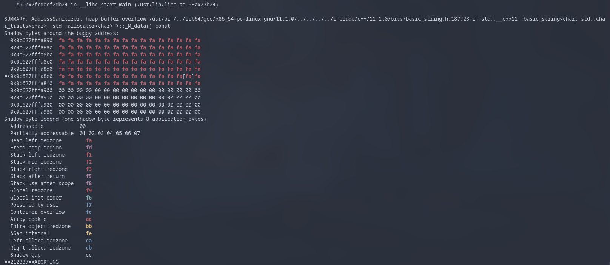

# Macumba with std::sort
Strange **heap buffer overflow** behaviour when sorting a vector with std::sort using a custom comparison functor.

## Build and run
This is prepared with meson to make your life easier. If you have meson installed run:
```bash
$ meson setup builddir
$ ninja -C builddir
```

You're all set!\
To run the *old* executable: `./builddir/old/old`\
To run the *new* executable: `./builddir/new/new`

## Additional notes
Both executables are being built with sanitizer options.
To make sure meson is using `clang` as it's default compiler you can do `CXX=clang++ meson setup builddir`.

If, however, you already have a build directory setup you can do `CXX=clang++ meson --reconfigure builddir --wipe`

This ensures meson will use `clang` as it's default compiler.

## Expected issue
This is a weird one. Because the compiler needs to know the addresses before the issue to detect that this is
indeed a **heap buffer overflor**, it may take some tries to get the expected output. These are the outputs to
be expected:
* The executable runs fine with no issues
* The executable aborts with segfault
* The executable aborts with segfault and the sanitizer detects the heap overflow\*


*\*expected output*